# Repo Checker

- [Repo Checker](#repo-checker)
  - [Usage](#usage)
  - [Parameters](#parameters)
    - [target](#target)
    - [fix](#fix)
    - [init](#init)
    - [quiet](#quiet)
  - [Todo](#todo)
  - [Benchmarks](#benchmarks)
    - [Old method](#old-method)
  - [Thanks](#thanks)

## Usage

Choose your favorite method :

1. Via npx : `npx repo-check`
2. Via npm locally : `pnpm install repo-check` then run `npx repo-check` or use it in your `package.json` scripts
3. Via local installation : clone this repository, cd into the folder and use `pnpm start`, `pnpm start --target=../my-other-project` for single run or `pnpm dev`, `pnpm dev --target=../my-other-project`

Pro tip : [init](#init) repo-checker before [fixing](#fix) files.

## Parameters

### target

`--target=path/to/folder` tells repo-checker which directory it should scan.
If no target is specified, repo-checker will scan current directory.
Target can be a relative or absolute path, can contain one project or more.

### fix

`--fix` kindly ask repo-checker to try to create missing files or update problematic ones.
For example, repo-checker will check for a `README.md`, if it does not exists, the file will be created and filled with data accordingly to the README.md template (`templates/README.md`).
Repo-checker will try to grab as much info as possible from the project folder to create this file.
If it's not enough, you'll be prompt to [init](#init).
If you want to fix already existing files, use `--force` to overwrite it.

### init

`--init` ask repo-checker to initialize a data config file in the current directory.
If file already exists, use `--force` to overwrite it.

### quiet

`--quiet` repo-checker will works silently without output-ing to console, will only output to log file.

## Todo

- [ ] if website : check static folder : should have "_headers" & "favicon.ico" and "manifest.json" files inside
- [ ] compute build/dist/folder/public size for maxSize compliance
- [ ] check `rel="noopener"` or `rel="noreferrer"` to any `<a` external links to improve performance and prevent security vulnerabilities
- [ ] check `width` and `height` attributes to any `` to get the average execution time in seconds.

| task       | lib          | seconds    | comment                                            |
| ---------- | ------------ | ---------- | -------------------------------------------------- |
| build      | tsup         | 1          | 0 config, 1 dep only, super fast                   |
| build      | rollup       | 2,7        | lots of deps (plugins) & config to do the same job |
| build      | esbuild      | 0,2        | amazing 👍                                          |
| check      | repo-checker | 3,2 (2019) | can surely be reduced ^^                           |
| check      | repo-checker | 0,8 (2021) |                                                    |
| lint       | xo           | 2,7        |                                                    |
| lint       | eslint       | 3,5        |                                                    |
| test       | ava          | 9          |                                                    |
| test       | mocha        | 7,4        | a bit faster, same amount of setup                 |
| test       | uvu          | 1,2        | amazing 👍                                          |
| test + cov | ava + c8     | 16         | 7 seconds for c8 coverage ? wtf                    |
| test + cov | mocha + c8   | 12         | 7 seconds for c8 coverage ? wtf                    |
| test + cov | mocha + nyc  | 9,6        | 2 seconds for coverage seems more reasonable       |
| test + cov | uvu + c8     | 1,6        | amazing 👍                                          |

## Thanks

- [Arg](https://github.com/vercel/arg) : un-opinionated, no-frills CLI argument parser
- [Dependency-cruiser](https://github.com/sverweij/dependency-cruiser) : handy tool to validate and visualize dependencies
- [Esbuild](https://github.com/evanw/esbuild) : an extremely fast JavaScript bundler and minifier
- [Eslint](https://eslint.org) : super tool to find & fix problems
- [Github](https://github.com) : for all their great work year after year, pushing OSS forward
- [Repo-checker](https://github.com/Shuunen/repo-checker) : eslint cover /src code and this tool the rest ^^
- [Shields.io](https://shields.io) : for the nice badges on top of this readme
- [Shuutils](https://github.com/Shuunen/shuutils) : collection of pure JS utils
- [V8](https://github.com/demurgos/v8-coverage) : simple & effective cli for code coverage
- [Vitest](https://github.com/vitest-dev/vitest) : super fast vite-native testing framework
- [Watchlist](https://github.com/lukeed/watchlist) : recursively watch a list of directories & run a command on any file system
